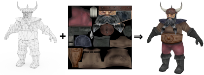
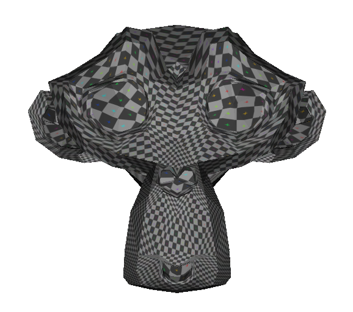
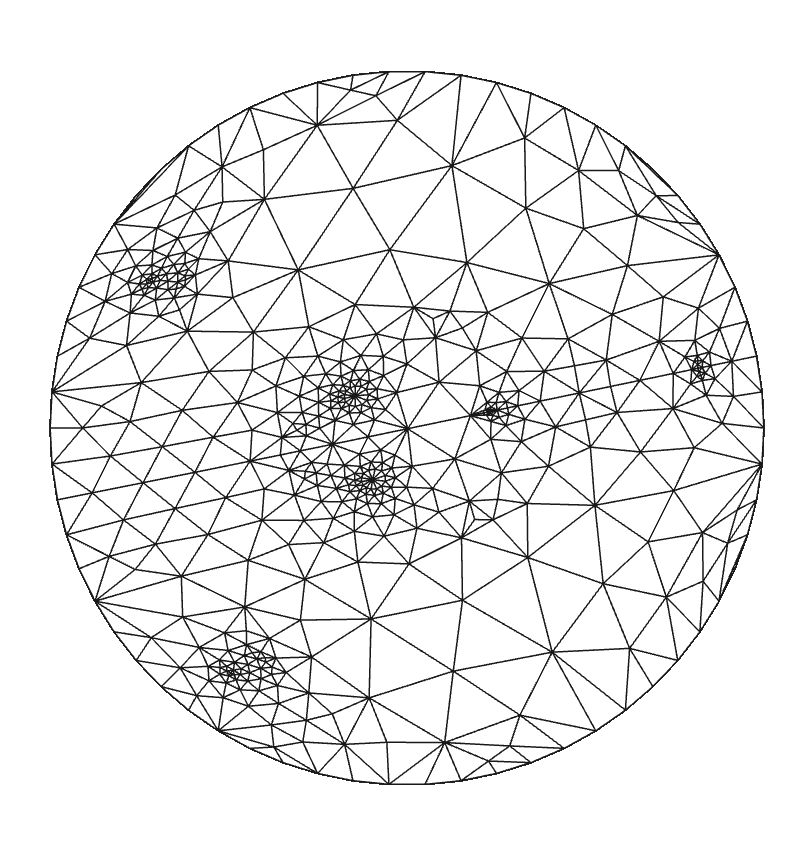

# Paramétrisation

Le but de ce projet est de travailler autour de la paramétrisation de maillages.
La paramétrisation est la base du placage de texture, qui permet de transférer
des données stockées dans une image à la surface d'un objet 3D.



## Mise en place

Ce TP se fera dans le cadre de gKit3 en utilisant l'extention gKit3GL. Si vous
ne les avez pas encore installés, commencez par le faire :

* [installation de gKit3](https://forge.univ-lyon1.fr/JEAN-CLAUDE.IEHL/gkit3.git)
* [installation de gKit3GL](https://forge.univ-lyon1.fr/JEAN-CLAUDE.IEHL/gkit3GL)

Placez vous ensuite dans le dossier `gkit3GL/projets` et clonez ce dépôt.
Modifiez enfin le fichier `gkit3GL/premake5.lua` pour intégrer le projet en
ajoutant ces lignes en fin de fichier :

```lua
project("parameterization")
  language "C++"
  kind "ConsoleApp"
  targetdir "bin"
  buildoptions ( "-std=c++20" )
  links { "gkit3GL" }
  includedirs { ".", "../src", "src", "projets/parameterization-etu/third_party" }
  files { "projets/parameterization-etu/src/*.cpp" }
```

## Application de base

Le dossier src est actuellement vide, commencez par créer votre application
openGL en dupliquant le fichier `gkit3GL/projets/tp2.cpp` (vous pouvez le nommer
comme vous le souhaitez). Ce fichier charge un maillage, ouvre une fenête et y
dessine le maillage.

Pour tester la paramétrisation, vous pourrez utiliser le maillage dans le fichier
`assets/suzanne_uvsplit.obj`. Ce maillage a la particularité d'avoir une couture
qui permettra de le déplier.

## Plaquer une texture

Paramétrer un maillage consiste à assigner à chaque sommet du maillage un
nouveau jeu de coordonnées en 2D pour le placer dans l'espace texture. Dans un
premier temps, pour tester, nous allons simplement utiliser les positions des
sommets comme paramétrisation. Seules les coordonnées x et y seront utilisées,
donc ce choix consiste simplement à projeter tous les sommets orthogonalement
sur le plan $z = 0$.

Pour transmettre les coordonnées de texture à votre carte graphique, dans la
fonction `init`, vous pouvez ajouter un troisième paramètre à l'appel à
`create_buffers` pour les fournir (ici donnez à nouveau `positions`). Pour
charger la texture sur la carte, vous pouvez commencer par charger votre texture
et l'associer à un identifiant, puis la configurer comme texture par défaut :

```cpp
  GLuint texture= read_texture(0, "nom_du_fichier.png") ;
  default_texture(0, texture);
```

Pour tester, dans le dossier `assets` vous avez un mailage `suzanne_uvplit.obj`
ainsi qu'une texture `blender_checker.png`.

Vous devriez voir apparaître des petits carreaux sur la surface de votre objet.

## Paramétrisation de Tutte

La paramétrisation de Tutte est une méthode issue de la théorie des graphes pour
disposer dans le plan un graphe planaire sans que deux arêtes ne se coupent.
Dans la suite, quand nous parlerons de *placer un sommet*, il s'agira de lui
attribuer des coordonnées de texture $(u,v)$. Le principe de la paramétrisationd
e Tutte est simple :

1. les sommets du bord sont disposés régulièrement sur un cercle
1. les autres sommets sont au barycentre de leurs voisins

Le fait qu'un point soit au barycentre de ses voisins est une contrainte
linéaire : sa coordonnée $u$ sera la moyenne des coordonnées $u$ de ses voisins,
et de même pour sa coordonnée $v$. En plaçant toutes ces équations dans un
système d'équations linéaires, nous avons autant d'équations que de coordonnées,
et nous pouvons donc résoudre ce système.

### Identifier les bord

Le maillage `suzanne_uvsplit.obj` a été découpé pour permettre le dépliement.
Une fois paramétrés, les sommets de cette découpe doivent se trouver sur un
cercle. Il va donc commencer par falloir identifier ces sommets. Lorsque votre
maillage est propre (c'est le cas ici), chaque arête qui n'est pas au bord est
adjacente à deux triangles. Pour distinguer les arêtes du bord, il suffit donc
d'identifier les arêtes qui ne sont que dans un seul triangle.

Pour cette identification, nous vous conseillons de déclarer l'alias suivant :

```cpp
using edge = std::pair<unsigned int, unsigned int> ;
```

De cette façon votre type sera automatiquement muni d'un opérateur de
comparaison (lexicographiuque), qui vous permettra de l'utiliser dans un
`std::set` ou une `std::map`. Nous vous proposons donc de construire un
`std::set` d'arêtes. Ensuite parcourez touts les triangles de votre maillage, et
pour chaque arête de vos triangle, commencer par vérifier si l'arête est déjà
dans le `std::set`. Si ce n'est pas le cas, c'est la première fois que vous
rencontrez cette arête, et vous pouvez l'ajouter au `std::set`. Sinon, c'est la
seconde fois, et l'arête ne fait pas partie du bord. Vous pouvez donc la retirer
de l'ensemble. À la fin l'ensemble ne contiendra donc que les arêtes du bord.
Attention, si un triangle contient l'arête $(a,b)$, le triangle voisin
contiendra l'arête $(b,a)$.

À vous ensuite de remettre les sommets dans l'ordre du bord. Si vous coincez,
demandez nous.

### Placer les sommets du bord sur un cercle

Si vous avez $k$ sommets sur le bord, alors leurs coordonnées dans l'espace
texture sont $\left(cos(\frac{2i\pi}{k}), sin(\frac{2i\pi}{k})\right)$ pour $i$
variant de $0$ à $k-1$. Pour les stocker, créez un nouveau `std::vector<Point>`,
et à l'indice des points du bord, assignez leurs coordonnées. Les points étant
3D, mettez le $z$ à 0.

### Placer les autres au barycentre de leurs voisins

#### Système

Si $n$ est le nombre de sommets du maillage, et si $k$ est le nombre de sommets
qui sont sur le bord, il vous reste $n-k$ sommets qui n'ont pas de coordonnées
$(u,v)$ et donc $2(n-k)$ variables à trouver. Imaginons un sommet $\mathbf{p}_0$
ayant pour voisins les sommets $\mathbf{p}_1$, $\mathbf{p}_2$, $\mathbf{p}_3$ et
$\mathbf{p}_4$. Le sommet $\mathbf{p}_0$ est au barycentre de ses voisins s'il
respecte la relation

$$
    \mathbf{p}_0 = \frac{\mathbf{p}_1 + \mathbf{p}_2 + \mathbf{p}_3 + \mathbf{p}_4}{4}
$$

En terme de coordonnées, pour la coordonnée $u_0$ nous devons donc avoir :

$$
    u_0 - \frac{1}{4}u_1 - \frac{1}{4}u_2 - \frac{1}{4}u_3 - \frac{1}{4}u_4 = 0
$$

et de même pour le coordonnées $v$. Mettons que parmi les voisins, le point
$\mathbf{p}_3$ soit sur le bord. Ses coordonnées ne sont donc pas des inconnues
car elles sont fixées, et l'équation devient

$$
    u_0 - \frac{1}{4}u_1 - \frac{1}{4}u_2 - \frac{1}{4}u_4 = \frac{1}{4}u_3
$$

D'un point de vue système linéaire et matrice, cette équation se traduira par
une ligne dans la matrice du système, avec le coefficient $1$ dans la colonne
correspondant à la variable $u_0$, le coefficient $-\frac{1}{4}$ dans les
colonnes des variables $u_1$, $u_2$ et $u_4$, et enfin un coefficient
$\frac{1}{4}u_3$ dans le membre droit du système pour cette ligne (il faut aller
chercher la valeur de $u_3$ que nous avons placé précédemment sur le cercle).

#### Implémentation

Pour faire de l'algèbre, vous aurez besoin d'une bibliothèque spécialisée. Nous
vous conseillons d'utiliser la bibliothèque `Eigen`. Pour l'utiliser :

1. téléchargez [la dernière distribution](https://gitlab.com/libeigen/eigen/-/archive/5.0.0/eigen-5.0.0.tar.gz)
1. décompressez l'archive, et déplacez le dossier `Eigen` dans le dossier `third_party` du projet

La bibliothèque est uniquement constituée d'entêtes c++, il n'y a donc pas
besoin de la compiler séparément, il suffit d'inclure ses entêtes.

Dans notre cas, nous allons avoir besoin de matrices, mais elles peuvent vite
devenir volumineuses car si le maillage à 10000 sommets, une matrice pleine
contiendra des centaines de millions de coefficients. Fort heureusement notre
système est *creux* : chaque équation ne concerne que quelques variables. Nous
allons donc utiliser des [matrices creuses](https://libeigen.gitlab.io/eigen/docs-nightly/group__TutorialSparse.html).
Commencez donc par inclure l'entête approprié

```cpp
#include "Eigen/Dense"
#include "Eigen/Sparse"
```

Pour construire une matrice creuse, il faut commencer par lister les
coefficients de la matrice sous forme de triplets, puis construire la matrice
avec cette liste. Chaque triplet contient la ligne, la colonne , puis le
coefficient. Si plusieurs triplet contiennent les mêmes lignes et colonnes, les
coefficients seront sommés. Par exemple :

```cpp
std::vector<Eigen::Triplet<float>> coefficients ;
coefficients.emplace_back(0,4,0.25) ;
coefficients.emplace_back(0,8,0.25) ;
//...
Eigen::SparseMatrix<float> M(10,10) ; //matrice creuse de taille 10x10
M.setFromTriplets(coefficients.begin(), coefficients.end()) ;
```

Pour le membre droit du système, nous pouvons utiliser un `VectorXf` de la
bibliothèque :

```cpp
Eigen::VectorXf rhs(10) ; //vecteur de taille 10
rhs[2] = 3 ;
//...
```

Une fois le système assemblé, il vous restera à le résoudre. La bibliothèque
`Eigen` contient de nombreux solveurs efficaces de systèmes d'équations
linéaires, vous pouvez par exemple utiliser la méthode du *graident conjugué*.

```cpp
  Eigen::VectorXf solution(10) //même taille que le nmbre de variables
  Eigen::ConjugateGradient<Eigen::SparseMatrix<float>> solver ;
  solver.compute(M) ;
  solution = solver.solve(rhs) ;
```

Attention, dans votre cas, toutes les coordonnées de tous vos sommets ne sont
pas des variables. Vous aurez donc besoin de commencer par renuméroter vos
variables pour faire le lien entre l'indice d'un sommet, et l'indice des lignes
de la matrice qui lui correspondent. Nous vous conseillons de créer une
`std::map` qui associe l'indice `i` d'un sommet à l'indice `j` tel que les
lignes du systèmes correspondant aux coordonnées du sommet i soient les lignes
`2j` et `2j+1`. Une fois la solution obtenue, pour chaque sommet, vous pouvez
utiliser cette correspondance pour aller chercher les deux coordonnées texture
du sommet via la `std::map`.

#### Visualiser

Si tout s'est bien passé, vous pouvez alors utiliser vos nouvelles coordonnées
u et v pour le placage de la texture et devriez obtenir quelque chose qui
ressemble de similaire à ça :



Et si vous visualisez le maillage déplié en utilisant les coordonnées $(u,v)$
comme positions de sommets, vous devriez voir quelque chose de semblable à ça :



### Least Squares Conformal Maps

La paramétrisation de Tutte crée beaucoup de distorsion entre l'espace texture
et l'espace 3D. Votre but maintenant est d'implémenter la méthode de
paramétrisation LSCM 
[évoquée en
cours](https://perso.liris.cnrs.fr/vincent.nivoliers/cgdi/documents/notebooks/lscm.html).

#### Gestion du bord

Pour cette méthode, vous n'aurez pas besoin de fixer le bord sur un cercle, vous
n'aurez qu'à fixer les coordonnées texture de deux sommets. Nous vous proposons
de sélectionner le point du maillage ayant la coordonnée y maximale et de le
placer dans l'espace texture en $(0.5,0.8)$, et le point ayant la coordonnée en
y minimale et de le placer en $(0.5,0.2)$. Le reste des sommets reste libre, et
vous avez donc $2(n-2)$ variables.

#### Construction du système

Le système contiendra deux équations par triangle du maillage, ce qui fait plus
d'équations que d'inconnues. Votre matrice sera donc rectangulaire et aura plus
de lignes que de colonnes. La méthode utilisera donc une résolution aux moindres
carrés, qui est également implémentée dans `Eigen` en utilisant le solveur
`Eigen::LeastSquaresConjugateGradient`. Ce solveur prend dont en entrée
directement la matrice rectangulaire, pas besoin de multiplier par la transposée
comme fait en cours.


## À vous de jouer

Pour ce projet, à vous d'aller plus loin ensuite. Nous vous proposons quelques
idées.

### Lancer de tomates

Faites en sorte de pouvoir jeter des tomates sur votre objet : lorsque vous
cliquez dessus, calculez par lancer de rayon le point du mailage visé, et
récupérez ces coordonnées textures. Dans la texture, ajoutez un impact de tomate
centré à cet endroit, puis rechargez la texture.


(image wikipedia)

### Dessin sur maillage

Créez un outil permettant de dessiner dans la texture en peignant directement
sur l'objet. Si vous avez besoin d'ajouter un menu ou des boutons simplement,
vous pouvez par exemple intégrer [imgui](https://github.com/ocornut/imgui).

### Serpent

Implémentez un jeu de serpent sur la surface de votre objet.
